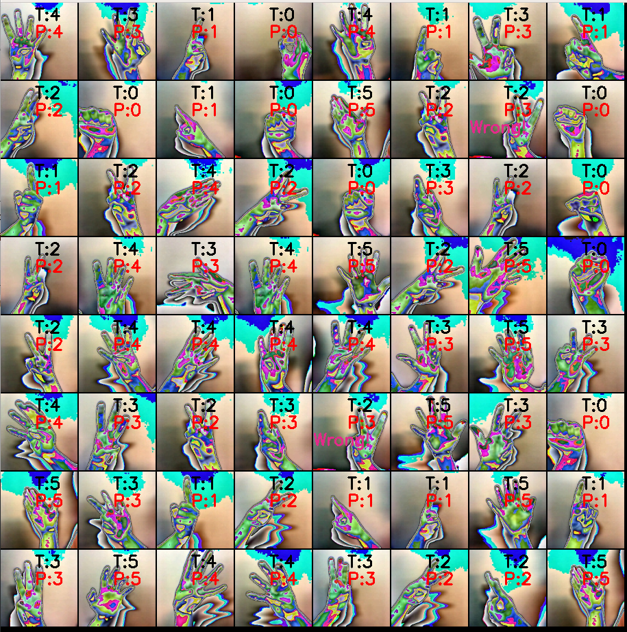
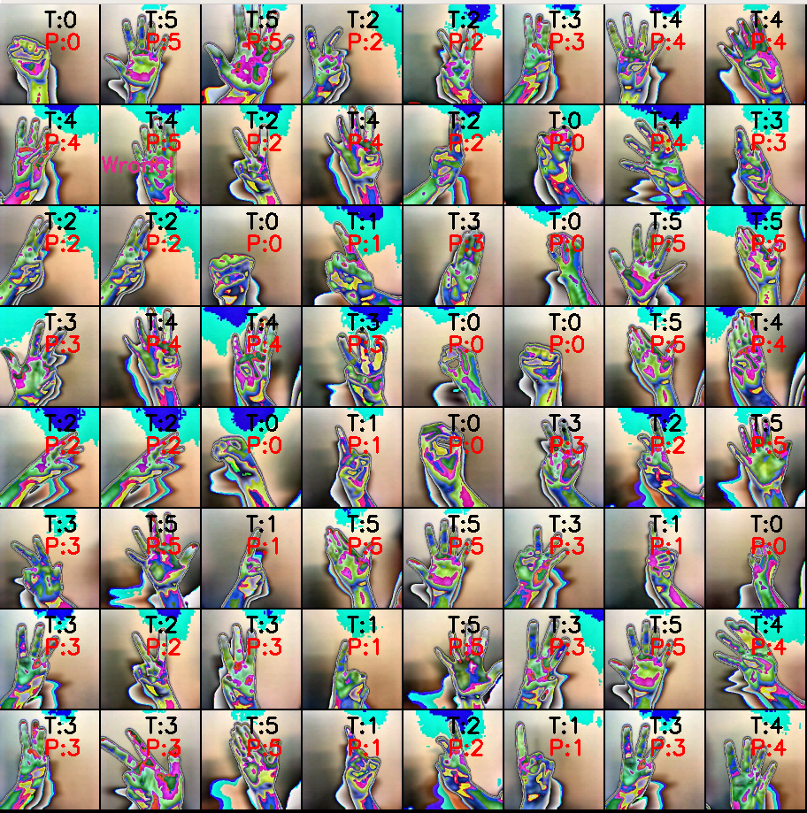

## Gesture recognition

### Introduction

Recognize numbers from 0 to 5 through gesture recognition
Using Pytorch as a framework, based on ResNet18
#### ResNet18 Model:
- Data preparation：
  - Run ` python ./data/dataprocess.py `
- Training steps：
  - Run `tensorboard --logdir=/Your Path/Gesture-recognition/CheckPoints/tensorboard &`
  - Run `python train.py -h` get usage
  - Run default parms `python train.py`
  - Checkpoint `checkpoint_epoch_x.pth.tar`in`./CheckPoints/snapshot/`
  - You can get training log file from `./CheckPoints/train.logs`
  
- Testing steps：
  - Run `python test.py -h` get usage
  - Run default parms `python test.py`
  
### Result
#### ResNet18 Model:
- Loss

  

- Predict

  
  
  

### Reference

- [pytorch](https://github.com/pytorch/pytorch)
- [pytorch_hand_classifier](https://github.com/LiMeng95/pytorch_hand_classifier)

